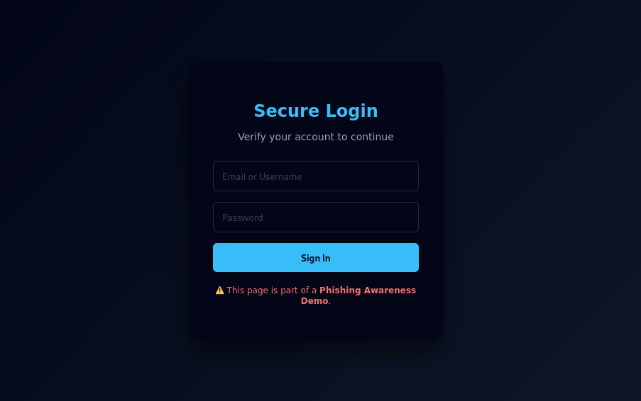

## 🌍 Live Demo
🔗 https://1RealHerman.github.io/phishing-awareness-lab/

> ⚠️ This live demo is for **educational purposes only** and does not collect or store any credentials.

## 📸 Project Screenshot

# Phishing Awareness Lab 🔐

## 📌 Overview
This project is designed to educate users on how phishing attacks work
and how to identify and avoid them.

## 🎯 Objectives
- Explain common phishing techniques
- Demonstrate how fake login pages look
- Educate users on phishing prevention

## 🛠️ Technologies Used
- HTML
- CSS
- Cybersecurity concepts

## 🧪 Phishing URL Detector (Python)

This project includes a simple Python-based phishing URL detector that
analyzes URLs for common phishing indicators such as:
- IP addresses in URLs
- Suspicious keywords
- URL length
- Missing HTTPS
## 🔍 How the Phishing URL Detector Works

The detector analyzes a given URL using a rule-based scoring system.
Each suspicious characteristic increases the risk score.

### 🧩 Detection Flow
User enters URL
|
v
Check URL structure
(length, dots, hyphens)
|
v
Check for IP address in URL
|
v
Check for suspicious keywords
(login, verify, secure, update)
|
v
Check HTTPS usage
|
v
Calculate risk score
|
v
Display verdict:
LOW RISK / SUSPICIOUS / HIGH RISK
### 🛡️ Why This Matters
This approach demonstrates how security tools apply multiple heuristics
rather than relying on a single factor, similar to real-world phishing
detection systems.

 ▶️ How to Run
bash:
python3 detector/phishing_detector.py

## ⚠️ Disclaimer
This project is for **educational purposes only**.
No credentials are collected, stored, or transmitted.

## 👨‍💻 Author
Herman Bannerman-Hesse  
Cybersecurity Student
